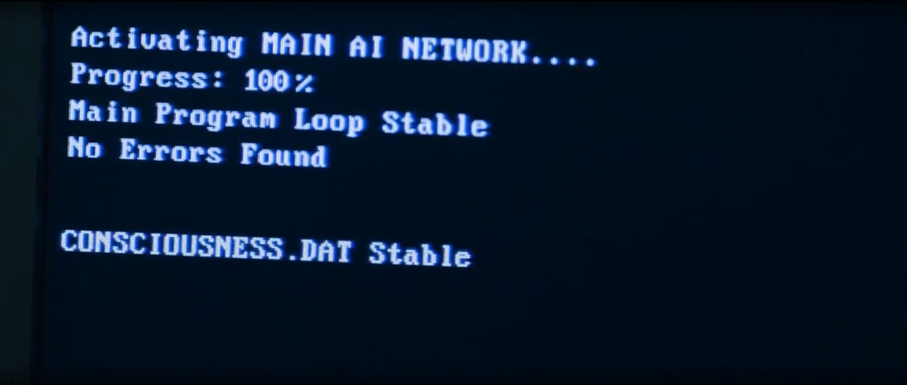
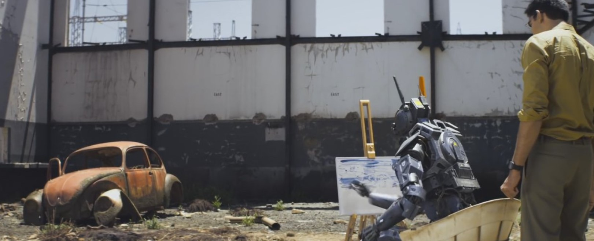

# CONCIOUSNESS.DAT

An experimental framework for embodiment of LLMs for real world hardware/robots, kinda like Chappie seemingly running off the eponymous ```CONCIOUSNESS.DAT``` file.



## Models to incorporate

* __Vision + Text__
    *  LLaVA - fine-tuned with ```Mistral-7B-Instruct```(or smaller) instead of ```Vicuna```
* __Text__
    * ```Mistral-7B-Instruct```(or smaller) LLM for tasks/thoughts
* __Image__
    * Latest ```YOLO``` to run at highest FPS for minimum ~720p resolution 

## Hardware

Depending on the form factors these could be quadruped/Spot like or droid/Chappie-esque but all joints to be compliant mechanisms using SimpleFOC driven motors

## Goals

* Personality & backstory of a new kind of brain that can run on various hardware, instead of the usual historical figure 
  
* Build a loop for idle/sleep state which is just to observe or ingest new data, ideally the core directive could be something as simple as to ensure task fullfilment so that the bot can sleep/charge itself & never let itself discharge

* Task creation framework & making use of function calling for getting tasks done by the underlying hardware
  
* Enabling parallel tasks by using a stage like stream for parallel sensory input & monitoring tasks being worked on. A max number of parallel tasks to monitor & an alerting system which overrides task preference including charging/falling down/someone yelling/remote-overrides etc

  
<hr>

